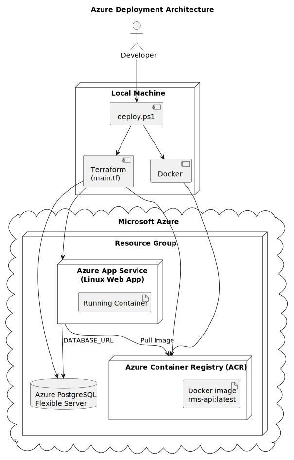
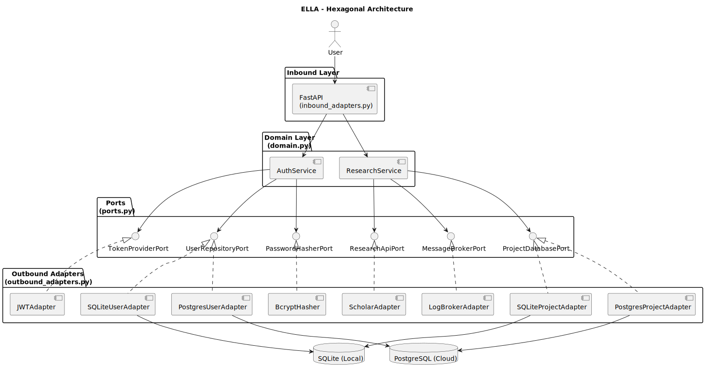
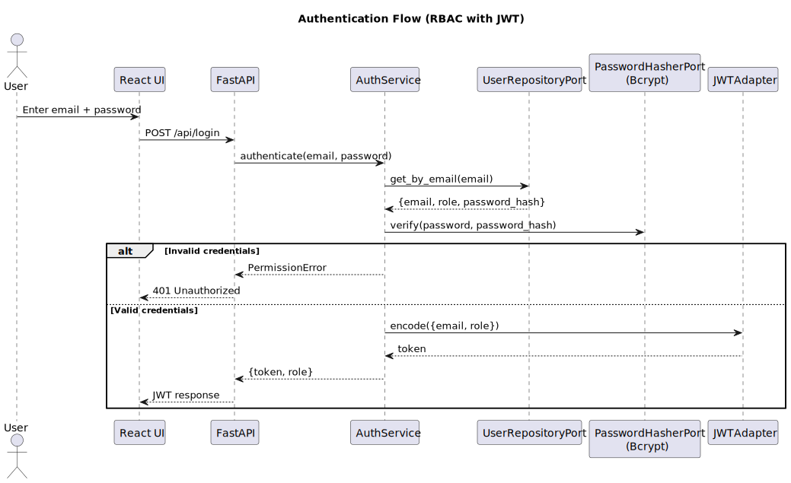

# ELLA: Secure Identity & Profile Management System

A Python backend built with the **Hexagonal (Ports & Adapters) Architecture**, containerized with Docker, and deployed to **Azure Cloud** using Terraform.

```
Browser  →  FastAPI (inbound adapter)
                │
            Domain Logic (ResearchService, AuthService)
                │
            Outbound Adapters ──→ PostgreSQL (Azure)
                                ──→ JWT Auth + Bcrypt
                                ──→ Scholar API
                                ──→ Event Broker
```

## Tech Stack

| Layer | Technology |
|---|---|
| API | FastAPI + Uvicorn |
| Auth | JWT (PyJWT) + Bcrypt password hashing |
| Database | SQLite (local) / PostgreSQL (cloud) |
| Container | Docker |
| Cloud | Azure App Service + PostgreSQL Flexible Server |
| IaC | Terraform |
| CI/CD | GitHub Actions |

## Run Locally (Docker)

```bash
docker-compose up --build
# Visit http://localhost:8002
```

Default login credentials:

| Role | Email | Password |
|---|---|---|
| Admin | admin@rms.com | admin123 |
| Researcher | researcher@rms.com | researcher123 |

## Deploy to Azure



### Prerequisites

- [Azure Account](https://azure.microsoft.com/en-us) (or [Azure for Students](https://azure.microsoft.com/en-us/free/students) — free, no credit card)
- [Azure CLI](https://learn.microsoft.com/en-us/cli/azure/install-azure-cli) installed
- [Terraform](https://developer.hashicorp.com/terraform/install) installed
- [Docker Desktop](https://www.docker.com/products/docker-desktop/) running

### Windows Users: Allow PowerShell Scripts

Windows blocks unsigned scripts by default. Run this **once** (you won't need to do it again):

```powershell
Set-ExecutionPolicy -Scope CurrentUser -ExecutionPolicy Unrestricted
```

### Deploy (3 commands)

```powershell
cd terraform

# Set your passwords (change these!)
$env:TF_VAR_pg_admin_password = "YourSecurePassword123!"
$env:TF_VAR_jwt_secret = "your-jwt-signing-secret"

# Deploy everything
.\deploy.ps1 setup
```

This will:
1. Log you into Azure
2. Create a PostgreSQL database, container registry, and App Service via Terraform
3. Build your Docker image and push it to Azure
4. Print your live URL

> **Note:** The first deployment takes 5-8 minutes. If you see a 503 error, wait 2-3 minutes for the container to start, then refresh.

### Update After Code Changes

```powershell
cd terraform
.\deploy.ps1 push
```

### Other Commands

```powershell
.\deploy.ps1 status    # Check app state and recent logs
.\deploy.ps1 logs      # Stream live container logs
.\deploy.ps1 debug     # Open /debug endpoint in browser
.\deploy.ps1 destroy   # Delete all Azure resources
```

### Environment Variables

These are set automatically by Terraform on Azure. For local development, defaults are used:

| Variable | Purpose | Default (local) |
|---|---|---|
| `DATABASE_URL` | PostgreSQL connection string | `sqlite:///./data/research.db` |
| `JWT_SECRET` | JWT signing key | `rms_secret_2026` |
| `DEFAULT_ADAPTER_MODE` | Which database adapter to use | `prod-sqlite` |

## Project Structure

```
ELLA/
├── .github/workflows/
│   └── main.yml         # CI/CD pipeline (test → build → deploy)
├── terraform/
│   ├── main.tf          # Azure infrastructure definition
│   └── deploy.ps1       # One-command deploy script
├── Dockerfile           # Container definition
├── docker-compose.yml   # Local development
├── ports.py             # Port interfaces (hexagonal)
├── domain.py            # Business logic (zero infra imports)
├── inbound_adapters.py  # FastAPI routes + dependency injection
├── outbound_adapters.py # DB, JWT, Bcrypt, API adapters
├── index.html           # React frontend
├── requirements.txt     # Python dependencies
└── .gitignore           # Keeps secrets and state files out of Git
```

## Architecture



The app follows the **Hexagonal Architecture** pattern with strict layer separation:

- **Ports** (`ports.py`) — Abstract interfaces that define what the domain needs
- **Domain** (`domain.py`) — Pure business logic with zero infrastructure imports
- **Inbound Adapters** (`inbound_adapters.py`) — FastAPI REST API + dependency factories
- **Outbound Adapters** (`outbound_adapters.py`) — SQLite, PostgreSQL, JWT, Bcrypt, Scholar API

### Adapter Symmetry

```
ResearchService → ProjectDatabasePort → SQLite/Postgres ProjectAdapter
AuthService     → UserRepositoryPort  → SQLite/Postgres UserAdapter
```

The active adapter can be swapped at runtime via the UI dropdown:
- `prod-sqlite` — Local SQLite database
- `prod-postgres` — Azure PostgreSQL (cloud)
- `dev-mock` — In-memory mock for testing

### Authentication Flow



1. User submits email + password
2. `AuthService` fetches user record via `UserRepositoryPort` (database-agnostic)
3. Password is verified via `PasswordHasherPort` (bcrypt)
4. On success, a JWT token is issued via `TokenProviderPort`
5. Subsequent API calls include the JWT in the `Authorization` header
6. `AuthService.authorize()` decodes the token to identify the user

The domain layer (`domain.py`) never imports SQLAlchemy, bcrypt, or any infrastructure library.


